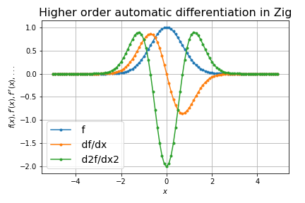

# zigrad

An experimental autograd in Zig

## Overview

Automatic differentiation (autograd) is pretty neat and very easy to get started.
For example, see [rustograd](https://github.com/msakuta/rustograd) for an implementation in Rust.
Why not try it out in Zig?

## Examples

* Sine wave

* Higher order AD

* Tape graph visualization

